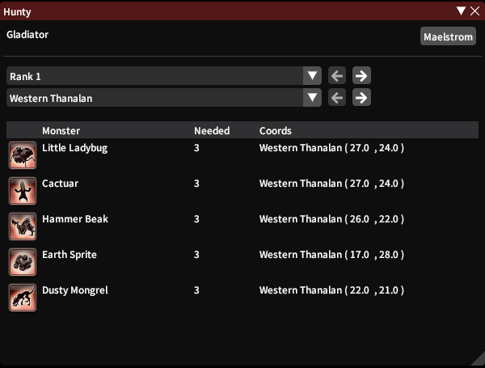
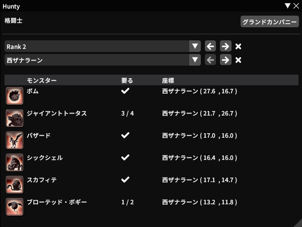

# *Hunty*  

Let's go hunt together, finally finishing that old log of yours~

## Features  
+ List of monsters in the same location based on Rank
+ Click the coords to open your map on the exact location
+ Click the dungeon name to open your duty finder
+ Easy switching between Grand Company and jobs
+ Automatic selection based on current job
+ Tracks all of the progress for you
+ Localizations for JP, DE and FR

## Guide Book  

## Localized languages (de, fr, jp)  

## Plogon

A Dalamud plugin for Final Fantasy XIV.

This repository is for development! If you just want to use this addon, you'll need to install the [FFXIV Quick Launcher](https://github.com/goatcorp/FFXIVQuickLauncher) and read the
[FAQ](https://goatcorp.github.io/faq/dalamud_troubleshooting.html#q-how-do-i-installenable-plugins).
  
  
## Thanks
#### Thank you MidoriKami for helping with the tracking