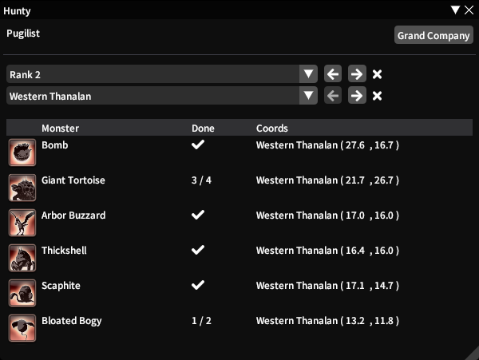

# *Hunty*  

A Dalamud plugin for Final Fantasy XIV.

This repository is for development! If you just want to use this addon, you'll need to install the [FFXIV Quick Launcher](https://github.com/goatcorp/FFXIVQuickLauncher) and read the 
[FAQ](https://goatcorp.github.io/faq/dalamud_troubleshooting.html#q-how-do-i-installenable-plugins).

## Features   
+ List of monsters in the same location based on Rank
+ Clickable coords to open your map on that exact location
+ Clickable dungeon name to open your duty finder
+ Easy to switch between Grand Company and Jobs
+ Automatic selection based on current job

## Guide Book  

## Localized languages (de, fr, jp)  

